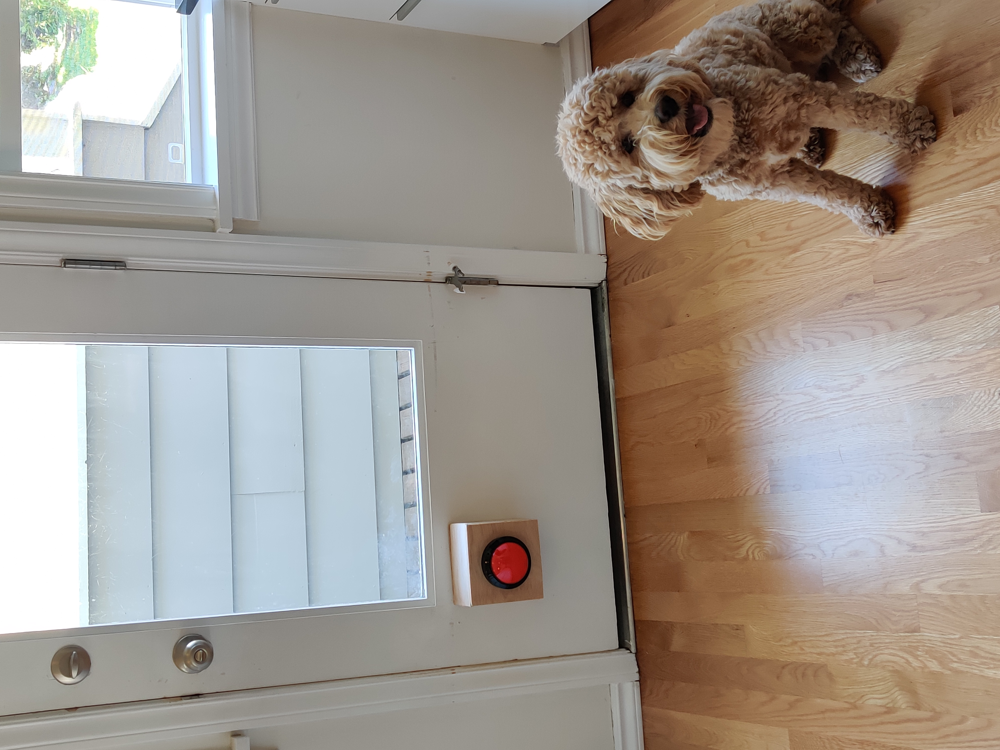
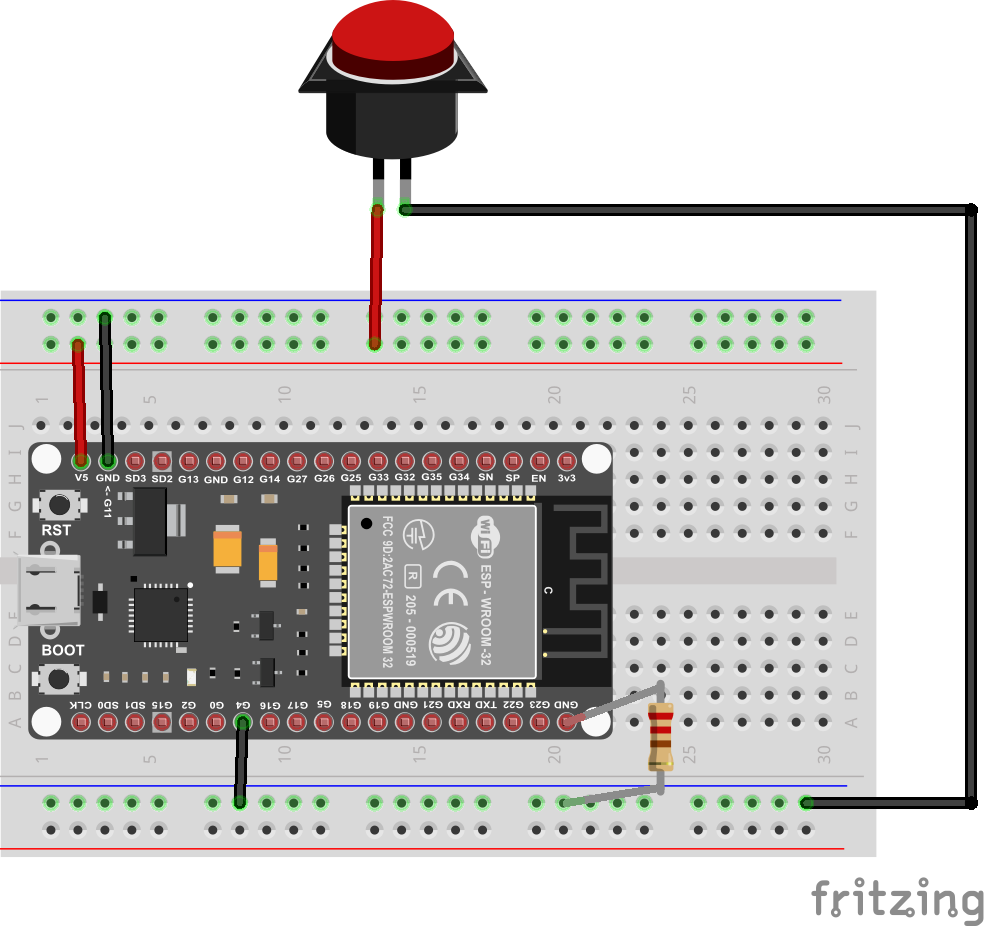
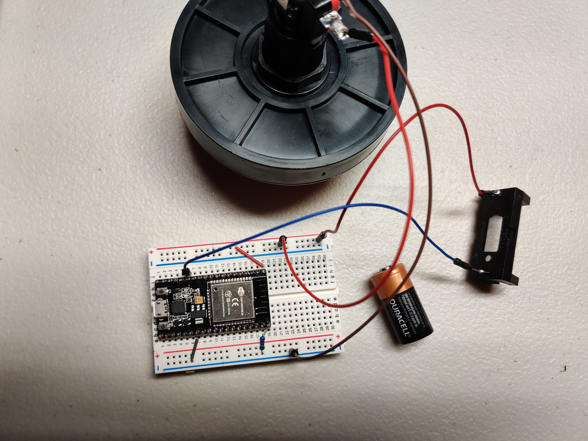

# Dog Button

This was made so my dog could text us when he wanted to go out instead
of banging on the blinds. It uses an ESP32 to run the code and Twilio to
send the text message.

## Hardware

 - ESP32. I used https://smile.amazon.com/dp/B09DPH1KXF?psc=1&ref=ppx_yo2ov_dt_b_product_details
   and the circuit diagram is made using the pins for this board.
 - Button: https://smile.amazon.com/dp/B01LZMANZ7?psc=1&ref=ppx_yo2ov_dt_b_product_details
 - 1k - 10k resistor. I'm using a 1k with a CR123 battery, but it might be
   better to start with a 10k.
 - Wires.

If you want it to be battery powered, I chose to avoid using a voltage
regulator and go with a CR123 battery.
 - Battery: https://smile.amazon.com/dp/B085LW4XKQ?psc=1&ref=ppx_yo2ov_dt_b_product_details
 - Battery holder: https://smile.amazon.com/dp/B07BKQSCPD?psc=1&ref=ppx_yo2ov_dt_b_product_details

# Instructions

1. Modified the code with your WiFi and Twilio information.
2. Upload to ESP32
3. Set up wires as shown below. For the button I chose, I had to solder the
   wires directly to the button.

4. Run the code and hit the button. You should receive a text.
5. If you want to use a battery, power both the button and the ESP32 by adding
   a wire to the 3.3V pin and the battery ground to a ground pin (pictured below).

